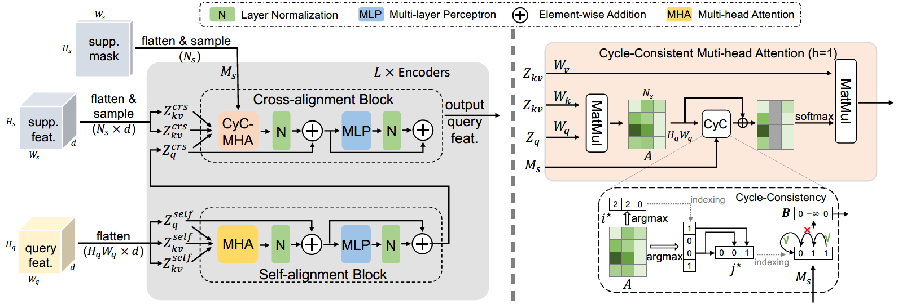

# CyCTR
This repo is for updating news related to our NeurIPS 2021 paper "[Few-Shot Segmentation via Cycle-Consistent Transformer](https://proceedings.neurips.cc/paper/2021/file/b8b12f949378552c21f28deff8ba8eb6-Paper.pdf)".

In CyCTR, We design a novel Cycle-Consistent Transformer (CyCTR) module for few-shot segmentation. CyCTR aggregates pixel-wise support (i.e., the few-shot exemplars) features into query (i.e., the sample to be segmented) ones through a transformer. As there may exist unexpected irrelevant pixel-level support features, directly performing cross-attention may aggregate these features from support to query and bias the query features. Our proposed cycle-consistent attention mechanism can effectively filter out possible harmful support features and encourage query features to attend to the most informative pixels from support images. 

# News
- `2021/12`: To be appeared in NeurIPS 2021 ([View NeurIPS Page](https://neurips.cc/virtual/2021/poster/27584)), welcome to discussion！
